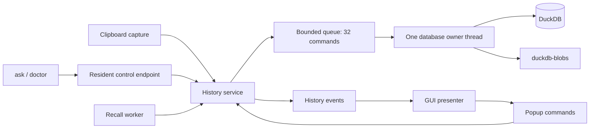

# DuckDB storage and application boundary

This document describes the DuckDB build (the default). The alternative SQLite build uses the same application service boundary; see [storage backends](storage-backends.md). In the DuckDB build, SQLite is linked only for reading migration sources.

## Ownership

`StoreOwner` moves the writable connection to one named worker. Commands are serialized and queued with backpressure; idle maintenance skips a busy owner. Shutdown drains accepted commands, checkpoints pending changes, and joins the owner. History events carry domain data and snapshot versions, while the presenter owns GUI locking and rejects out-of-order snapshots. The recall worker retains cancellation and bounded results. Some command callers still synchronously await completion; this is not a claim that every GUI command is asynchronous.

CLI queries use the resident endpoint, including the existing Windows authenticated loopback transport. If no resident endpoint exists, the short-lived `ask` command acquires the same single-instance guard before opening the store itself. A resident that is still initializing or rejects a query produces an error rather than opening a competing writer. Queries and responses are bounded by the local control framing contract.

## Physical storage

The default file is `history.duckdb` in the existing application data directory. Large immutable flavor bodies live in `duckdb-blobs/`. SQLite's old `history.db` and `blobs/` are independent retained migration sources.

The physical DuckDB schema is version 1. The exported `SCHEMA_VERSION = 7` identifies the frozen legacy data contract; `DUCKDB_SCHEMA_VERSION` identifies the native schema. Export v1/v2/v3 fixtures and manifest bytes are unchanged.

SQL triggers and cascading side effects have been replaced by explicit transactions. Clip deletion removes annotations, residency, facets, audit/merge rows, embeddings, session protection and file references in the same transaction. A failed mutation rolls the transaction back. Recency and merge counters live in transactional metadata rows. A crash-recovery test exposed a WAL-replay failure with sequence-valued column defaults in the pinned build; explicit counters avoid that path.

DuckDB runs with two execution threads, a 256 MB engine memory limit, no automatic extension installation/loading, and no external SQL access. The memory limit is an engine setting, not a total process RSS guarantee. JSON support is bundled. Search uses native scans over the current projection, with core recall verification for popup semantics. There is no SQLite FTS5 index or automatic search grammar change at a row-count threshold. Literal store search uses Unicode-insensitive `ILIKE`; punctuation stays literal.

## Migration

1. Open SQLite read-only and begin a consistent read transaction. Refuse unsupported versions or failed integrity checks.
2. Create a private, uniquely named staging DuckDB file and native schema.
3. Copy canonical and lifecycle tables. Compare counts and canonical hashes of every copied field in primary-key order. Search and file-reference projections are rebuilt rather than copied as authoritative state.
4. Validate clip metadata, content hashes and every referenced file. Copy immutable payloads into the new CAS; verify the hashes. Missing/corrupt files stop publication.
5. Verify required lifecycle records and relationships, checkpoint the staged database, then publish without replacing an existing destination.
6. Retain the original SQLite file and original CAS. A failed attempt leaves the original source intact and does not publish a destination database.

The application single-instance guard precedes migration in resident startup. Library callers must also ensure no legacy application is writing the migration source. Retained SQLite files still contain historical content and are not covered by new DuckDB retention. They are recovery artifacts, not a managed backup service. Interrupted staging artifacts may remain private until explicitly cleaned; the importer does not delete unrelated migration backups.

## Privacy and verification limits

The live database remains unencrypted. Secret classes already restricted to process memory stay there. Sensitive durable clips do not receive text/fingerprint/embedding projections and remain subject to expiry. A DuckDB checkpoint can reclaim the WAL, but cannot guarantee erasure from old database blocks, filesystem snapshots or retained SQLite sources. The doctor reports logical schema/relationship validation, not SQLite `quick_check` or a complete native-engine physical integrity scan.

Automated checks cover native persistence/reopen, committed WAL recovery after abrupt process exit, migration of old schemas, preservation on failure, missing files, owner-only paths, transactional rollback, deletion and CAS accounting, archive/expiry/holds, encrypted grace recovery, recall, and CLI transport to the owner. The local release-mode, in-memory budget measured 1,000 inserts in 1,140 ms and 100 searches in 113 ms. These are bounded smoke measurements, not disk or popup latency. Earlier SQLite recall benchmarks do not establish DuckDB latency. Live cross-platform desktop and performance qualification remain separate from these checks.
